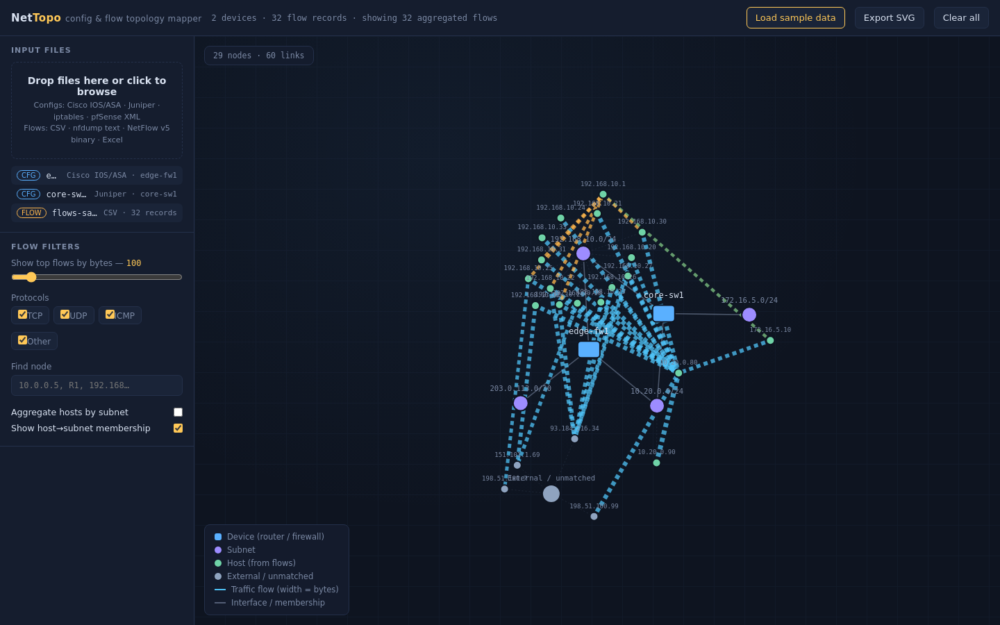
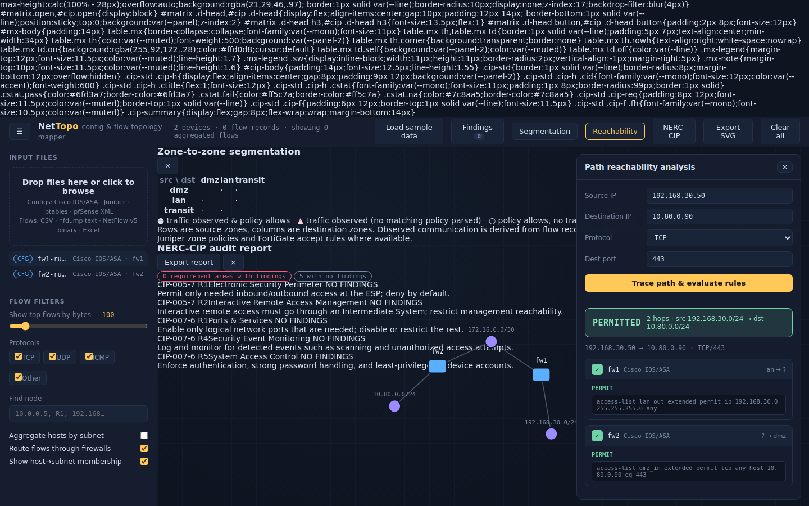
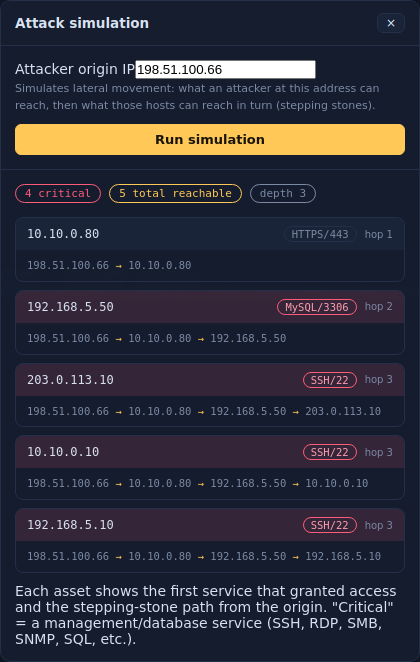
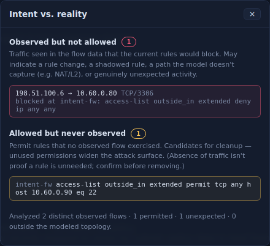
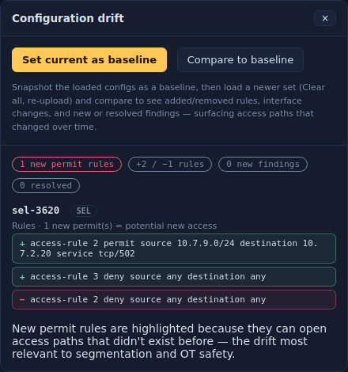

[README.md](https://github.com/user-attachments/files/30515779/README.md)[Upl# NetTopo

**A single-file, offline network configuration & flow analyzer for IT and OT environments.**

NetTopo ingests firewall/switch/router configuration files and NetFlow traffic data, renders an interactive network topology, and runs security analysis — per-rule reachability, NAT modeling, attack-path simulation, segmentation analysis, Layer-2 modeling, configuration-drift tracking, and heuristic NERC-CIP mapping. It runs entirely in your browser as a single self-contained HTML file. Nothing is uploaded anywhere.

> ⚠️ **Read the [Disclaimer](#disclaimer) before relying on any output.** NetTopo is an analysis and exploration tool, **not** a certified compliance product. Its verdicts should be independently validated before they inform real security or audit decisions.

---

## Table of contents

- [What it does](#what-it-does)
- [Screenshots](#screenshots)
- [Quick start](#quick-start)
- [Supported inputs](#supported-inputs)
- [Features](#features)
- [How it works](#how-it-works)
- [Privacy & network posture](#privacy--network-posture)
- [Disclaimer](#disclaimer)
- [Limitations](#limitations)
- [Comparison to NP-View](#comparison-to-np-view)
- [Development & testing](#development--testing)
- [Roadmap](#roadmap)
- [License](#license)

---

## What it does

You drop in device configs and (optionally) flow data. NetTopo:

1. **Parses** the configs into a normalized model (interfaces, zones, VLANs, ACLs/policies, NAT).
2. **Draws** an interactive topology showing devices, subnets, hosts, VLANs, and observed traffic.
3. **Analyzes** the network — answering questions like *"can host A reach host B on port N, and which rule decides it?"*, *"what can an attacker at X pivot to?"*, *"what does the traffic actually show versus what the rules allow?"*, and *"what changed between config versions?"*

Everything happens locally in the browser. There is no server, no account, and no data leaves your machine.

## Screenshots

> Add your own screenshots to `docs/` and update these paths. Sample captures produced during development are included in this repository.

| Topology + flows | Reachability (per-hop rule evaluation) |
|---|---|
|  |  |

| Attack simulation | Intent vs. reality | Config drift |
|---|---|---|
|  |  |  |

## Quick start

**There is no build step and no installation.**

1. Download `nettopo.html`.
2. Open it in a modern browser — double-click the file, or drag it into a browser tab.
3. Drag your config and flow files onto the drop zone (or click **Load sample data** to explore with a built-in example).

The libraries it uses (D3 for the graph, SheetJS for spreadsheets) are **inlined** into the file, so it works fully offline with no internet connection.

For sensitive configurations, see [Privacy & network posture](#privacy--network-posture) — opening the file in a private/incognito window with extensions disabled is the belt-and-suspenders option.

## Supported inputs

### Configuration files (13 vendors)

**Enterprise / IT**
- Cisco IOS & ASA (ACLs, object-groups, `object network`, NAT, security-levels, VLANs/SVIs)
- Juniper (set-format & hierarchical; zones, address-book, applications)
- FortiGate / FortiOS (policies, address & service objects, VIPs)
- Palo Alto PAN-OS (set-format; zones, address/service objects & groups)
- Arista EOS (named ACLs, CIDR entries, interface bindings, IPv6 ACLs)
- iptables (filter rules, chain policies, DNAT/SNAT/MASQUERADE)
- pfSense (XML rule export)

**Operational Technology / ICS**
- Hirschmann (Belden industrial switches)
- Moxa (secure routers / EDR series)
- Siemens SCALANCE (industrial firewall / cell-to-cell rules)
- SEL — Schweitzer Engineering Labs (substation security gateways)
- Phoenix Contact mGuard (industrial firewall)
- Waterfall (unidirectional gateway / data diode — models hardware-enforced one-way flow)

> **Note on OT parsers:** OT/ICS configuration formats are diverse and often proprietary. NetTopo's OT parsers target common, representative patterns and **should be validated against your actual device exports**, which may use format variations that are not yet handled.

### Flow data

- CSV (auto column detection)
- nfdump text output
- NetFlow v5 binary
- Excel (`.xlsx`)

> NetFlow v9 / IPFIX are not parsed; NetTopo will tell you and suggest an alternative export.

## Features

| Feature | Description |
|---|---|
| **Topology mapping** | Interactive D3 force-directed graph of devices, subnets, hosts, VLANs, and flow edges (colored by protocol, weighted by bytes). |
| **Security audit** | Per-vendor rule checks (permit-any, telnet/HTTP mgmt, default/weak SNMP, etc.) plus flow-behavior analysis (port scans, sweeps, cleartext protocols, external→mgmt access). |
| **Per-rule reachability** | Trace a 5-tuple (src, dst, proto, port) hop-by-hop; get a permit/deny verdict with the **exact deciding rule** at each device. Direction-aware (inbound/outbound ACL bindings), with nested object-group and service-object resolution. |
| **NAT modeling** | Destination NAT (port-forwards, VIPs, static NAT) translated at ingress with ASA 8.3+ real-IP semantics; source NAT (SNAT/MASQUERADE) modeled on egress. |
| **ASA security-levels** | Correct default behavior on unbound interfaces (high→low permit, low→high deny, same-level deny unless `same-security` configured). |
| **Attack simulation** | Transitive stepping-stone reachability from an attacker origin; shows reachable assets, the service that granted access, and the full lateral-movement path. NAT-aware; handles external origins. |
| **Zone segmentation matrix** | Zone-to-zone grid distinguishing observed traffic, policy-allowed paths, and no-communication. |
| **Layer-2 modeling** | VLAN parsing and labeling; intra-VLAN traffic correctly treated as **switched at L2 (not filtered by L3 ACLs)** — with private-VLAN/protected-port isolation and access-port ACLs accounted for. |
| **Intent vs. reality** | Compares observed NetFlow against what the rules permit: flags **traffic that occurred but rules would block**, and **permit rules no traffic ever used** (cleanup candidates). |
| **Configuration drift** | Snapshot a baseline, load a newer config set, and diff: added/removed rules, interface changes, new/resolved findings — with **new permit rules highlighted** as newly-opened access paths. |
| **NERC-CIP report** | Maps findings to CIP-005 / CIP-007 requirement areas; exportable as a standalone printable HTML document (heuristic — see disclaimer). |
| **IPv6** | The reachability engine evaluates IPv4 and IPv6 rules and endpoints. |
| **Exports** | Topology SVG, findings CSV (formula-injection guarded), and the NERC-CIP report as HTML. |

## How it works

NetTopo is a single HTML file containing:

- A **reachability engine** (vendor-agnostic rule IR + a 5-tuple evaluator with first-match, implicit-deny, zone scoping, binding awareness, NAT translation, and IPv6 support).
- **Per-vendor parsers** that compile each config into that common rule model plus a topology model.
- A **D3-based renderer** for the interactive graph.
- An **audit engine** and the analysis panels (reachability, attack sim, segmentation, intent-vs-reality, drift, NERC-CIP).

There is no backend. All parsing and analysis run client-side in JavaScript.

## Privacy & network posture

NetTopo is designed to be safe to run against sensitive firewall configurations:

- **No uploads, no server.** All processing happens in-browser, in memory. Files are read via local drag-and-drop / file picker; exports are generated locally as download blobs.
- **No external dependencies.** D3 and SheetJS are inlined into the HTML — there are **zero** external `<script src>` references and no CDN calls.
- **Egress blocked by policy.** The file ships with a Content-Security-Policy including `default-src 'none'` and `connect-src 'none'`, so the browser will refuse any outbound network connection the page might attempt.
- **No persistence.** Nothing is written to disk or browser storage; the drift baseline lives in memory only and is cleared when you close the tab.

**Verify it yourself:** open the file in a text editor and confirm it contains no `cdnjs`/`http` script sources and that the CSP includes `connect-src 'none'`. For maximum isolation, run it in a private window with extensions disabled, or on an air-gapped machine. Because this is a tool you're trusting with sensitive data, an independent code review before production use is strongly encouraged.

## Disclaimer

**NetTopo is a heuristic analysis and exploration tool. It is not a certified compliance product and its output must not be treated as audit evidence without independent validation.**

- The **NERC-CIP report** is a triage aid that maps findings to a subset of requirement areas. It does **not** evaluate sub-requirements, compensating controls, or documented exceptions, and is **not** a substitute for a qualified assessor. The exported report includes this disclaimer.
- **Reachability verdicts** depend on correct parsing. Where a rule references an object that couldn't be resolved, the result is flagged as uncertain rather than guessed — but you should still verify important verdicts against the device itself.
- **OT vendor parsers** target representative formats and need validation against real configs.
- NetTopo models **L3 policy reachability** plus L2 switching/isolation; it does not fully model stateful return traffic, every NAT variant (e.g. twice-NAT, hairpinning), or advanced features not listed above.

Use it to explore, triage, and generate hypotheses — then confirm anything that matters.

## Limitations

- **Vendor coverage** is 13 vendors targeting common config constructs; exotic or rarely-used syntax may not parse.
- **NAT**: destination and basic source NAT are modeled; twice-NAT, hairpinning, and dynamic PAT source-tracking downstream are not.
- **Palo Alto `application-default`** is treated as any-port (can over-permit) because application signatures aren't modeled.
- **Layer-2 isolation** is modeled at VLAN granularity (a VLAN is flagged isolated if it has protected/private-VLAN ports); configs don't map host IPs to switchports, so per-port host placement isn't tracked.
- **Drift** is session-based — the baseline is held in memory and lost on reload; there is no historical/continuous monitoring.
- **IPv6** is supported in the reachability engine; topology and flow visualization are strongest on IPv4.
- **No auto-retrieval** — you supply the config files manually.

## Comparison to NP-View

NetTopo was built to replicate the core *analysis* that [NP-View](https://www.network-perception.com/) (Network Perception, now part of Dragos) is known for — reachability/access-path analysis, firewall-rule evaluation, segmentation, attack paths, drift, and topology mapping — and it adds an observed-traffic (NetFlow) dimension that NP-View does not emphasize.

**However, NP-View is a validated commercial product and NetTopo is not.** NP-View is trusted by NERC auditors for compliance audits, supports 25+ vendors battle-tested against real-world configs, offers config auto-retrieval and continuous monitoring, and is an enterprise platform. NetTopo is a free, single-file, offline analyzer with representative (not audit-grade) parsing and no monitoring.

**Use NetTopo** for fast, private, zero-cost exploratory analysis of a supported environment. **Use NP-View** (or a comparable validated product) where certified compliance evidence, broad validated vendor coverage, or continuous monitoring is the requirement. NetTopo is not a substitute for a supported, certified platform.

## Development & testing

The analysis is covered by an extensive test suite:

- **Engine unit tests** (Node) exercise the reachability engine directly — rule parsing, 5-tuple evaluation, NAT, ASA semantics, IPv6, and every vendor extractor, with known-verdict cases (including industrial protocols like Modbus/502 and EtherNet-IP/44818).
- **Browser end-to-end tests** (Puppeteer) drive the UI: parsing, topology, findings, reachability, attack sim, segmentation, NERC-CIP export, intent-vs-reality, drift, and Layer-2 behavior.

Contributions that add vendor coverage or tighten a modeling approximation are welcome — please include tests with known-correct verdicts, since a wrong permit/deny is worse than no answer.

## Roadmap

Potential future work, roughly by value:

- Broader vendor coverage (e.g. Check Point, Cisco FMC/Firepower) and more OT devices.
- Persistent / historical drift tracking across sessions.
- Source-NAT hairpinning and twice-NAT modeling; Juniper NAT rule-sets.
- Per-port host-to-switchport mapping to complete Layer-2 isolation modeling.
- Vulnerability-scanner import to map CVEs onto attack paths.

*NetTopo is an independent tool and is not affiliated with, endorsed by, or derived from Network Perception, Dragos, or any vendor whose configuration formats it parses.*
oading README.md…]()

